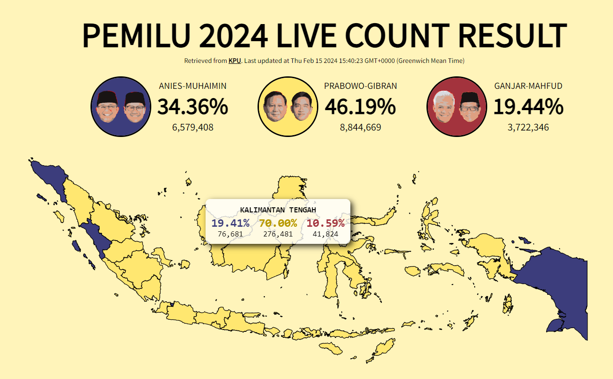

# pemilu2024-visualized
Interactive data visualization of the real time count result of 2024 Pemilu in D3.js. Can be accessed through [here](https://hariesramdhani.github.io/pemilu2024-visualized/).

Will update the README and refactor codes later after work.
